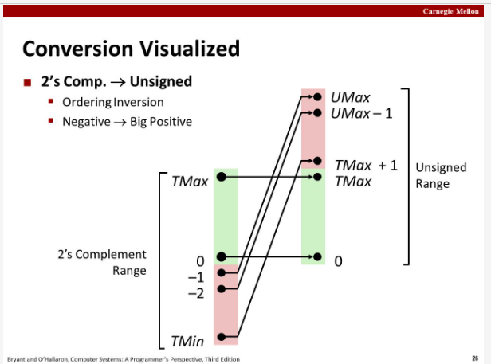
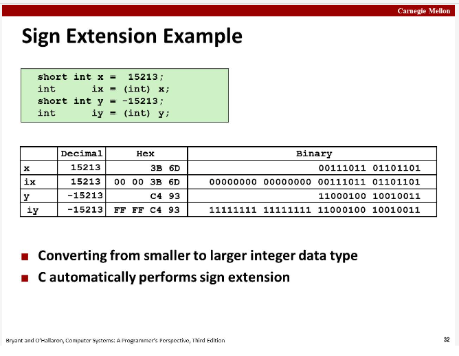
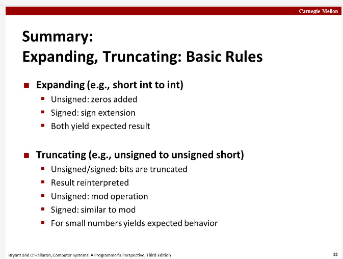

## 一、数的机器层面表示(machine representation of number)

<small>对应 CS:APP 一书第二章<small>

计算机只能存 0 或 1，在机器上保存整数其实讨论的是，如何编码 0 和 1 使其能代表不同整数数值。

计算机的基本存储单位是 byte，一个 byte 由 8 个 bits 组成，1 bit 要么存 0 要么存 1，那么一个 byte 可以表示**256种不同的组合**，每个组合表示1个整数，如 `00000000` 表示 `0`, `00000001` 表示 `1`, 可以表示 256 个不同的整数，所以有：

1 Byte 可以表示：
	- 二进位：从 `00000000` 到 `11111111`；
	- 十进位 Deximal：从 0 到 255；
	- 十六进位 Hexadecimal：从 00 到 FF；

说一个电脑是 64-bit 机器，意思是它的 address(pointer) 是用 64 bits(8 bytes) 来存的。

### 1.1 Bit-Level operation in C

#### operation `&`, `|`, `^`, `~` are available in C. They:

	- apply to any integeral data type. 适用于任意整型，如long int, int, short int, char, unsigned.
	- view arguments as bit vectors, 这些操作将 arguments 视为 bit vectors.
	- arguments applied bit-wise, 按每个 bit 位进行操作

注，要与逻辑操作符 `&&`, `||`, `!` 区分，逻辑操作符返回的是 0 或 1，将 0 视为 False，1 视为 True.

#### shift operation 位移操作

    - left shift: throw extra bits on left; fill with 0's on the right.
    - right shift

### 1.2 Encoding integers

有两种编码整数的方式，它们能表示的范围不同：

	- unsigned: 无符号表示
	- signed(2-complement): 有符号数，二补数

假设用 w 位表示一个整数

对于无符号数：
	- UMax = 2 ^ w - 1. (8 位，能表示的最大无符号整数 `11111111`, 255)
	- Umin = 0

对于有符号数：
	- TMax = 2 ^ (w-1)-1. (8 位，能表示的最大有符号数 `01111111`, 127)
	- TMin = -2 ^ (w-1). (8 位，能表示的最小有符号数 `1111111`, -128, 注，最开头的 1 是符号位，sign bit，代表是 -(2^8) )

#### mapping signed and unsigned

C 语言中的 signed & unsigned

	- by default are considered to be **signed integers**, 默认皆为有符号整数
	- unsigned if have "U" suffix，后缀加 U 变为无符号整数
	- 一个操作涉及到有符号数和无符号数时，有符号数会隐式转为无符号数

两者的转换参考下图：
 
参考下图：

#### 位数扩展与缩减

要将 4-bits 扩展为 8-bits ，同时保持值不变，怎么做？

task:
	- given w-bit signed integer X
	- convert to w+k-bit integer with same value

rules:
	- make k copies of sign bit

在 4-bits 数的最前面插入 4 个该数的符号位即可。

解释：

	- 正数：sign bit 为 0，往前插多少个 0 都会保持原值，同时扩展其位数
	- 负数：sign bit 为 1，往前插 k 个 1，只有第一个 1 会变负，其他都是正，并且这些插入的 1 之和和原本的符号位相同。

参考下图：

### 1.3 [整数的计算](./整数的计算.md)

- 加减法在 bit level 层面的操作
- 乘除法在 bit level 层面的操作

### 1.4 在内存中储存整数](./在内存中储存整数.md)

## 2. [浮点数的机器表示](./floating-point.md)

