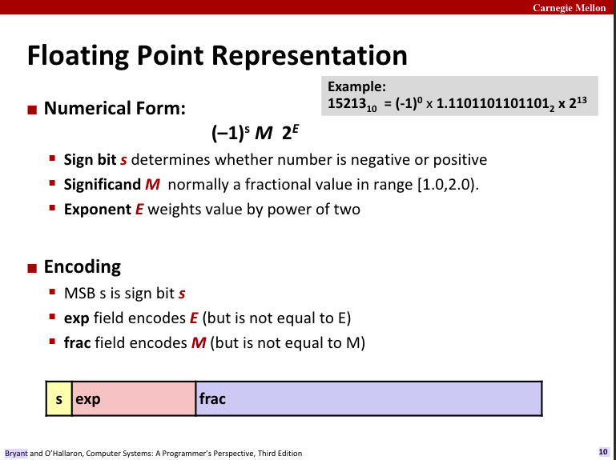
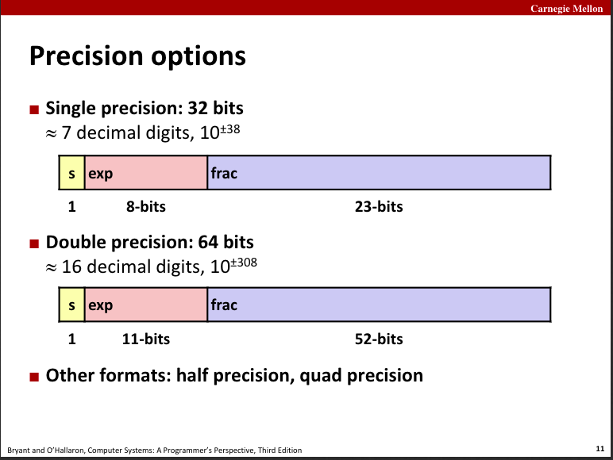

## 浮点数

[课程录像](https://scs.hosted.panopto.com/Panopto/Pages/Viewer.aspx?id=8dd08ed5-7688-4b34-937f-201b909f61c7)

### 二进制小数的表示

二进制表示的小数解读方式和十进制小数的一致，只不过是以 2 为底来算。

如二进制：10.1112， 转成十进制：22+2-1+2-2+2-3，叫 `2又7/8`

这种形式表示小数部分的限制：

1. 只能精确表示形如 x/(2k)，这是从二进制表示小数的方式反推的，因为小数部分是由 (1/2 + 1/4 + 1/8 + 1/16 +... + 1/2k) 依次加起来的。

如，`1/2` ==> 0.12, `1/4` ==> 0.012

其他小数会用循环某个 bit pattern 的方式表示，这种表示是一种近似，因为计算机能够存浮点的位数是有限的。例如：

如， `1/3` ==> 0.0101010101[01]...2

2. 用来表示小数的二进制位是有限的

还有，这种表示不能

### IEEE 754 标准

美国电气电子工程师协会于1985年制定的浮点数表示标准，如下：

(-1)sM2E

s: 符号位
M: [1.0, 2.0)之间的小数值，叫 significand M
E: 以2为底的指数

对这三个位做编码，参考下图

浮点数精度：

3 种浮点数形态（没听懂）：

	- denormalized
	- normalized
	- special

**练习 2.47** p81

给定浮点表示：1个符号位，2个阶码位，2个小数位，写出对应的指数字段（e, E, 2E)、小数字段（f、M）和十进制值

**练习2.48** p83

已知整数`3510593`的十六进位表示`0x00359141`，推导出单精度浮点数 `3510593.0` 的十六进位表示，上述题目反过来。

- 二进制表示：00110101 10010001 01000001
- 向右位移21位：1.10101 10010001 01000001 * 221
- 小数部分：直接取小数点右边的所有位，补上两个0，得到23位小数：10101 10010001 01000001 00
- 指数部分：阶码=21(指数位) + 127(Bias=27 - 1) = 148，十六进制`0x94`, 二进制[10010100]
- 加上符号位0，拼起来得到：[0 10010100 10101 10010001 01000001 00]
- 转为十六进制：`0x4a564504`

---

（7.5）浮点数目前学到推导单精度浮点数表示的程度，三种形态暂未理解。复习时要看习题2.48

